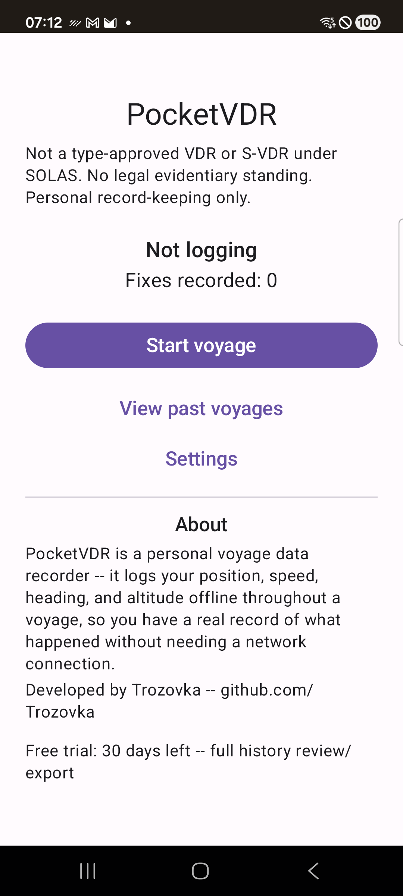
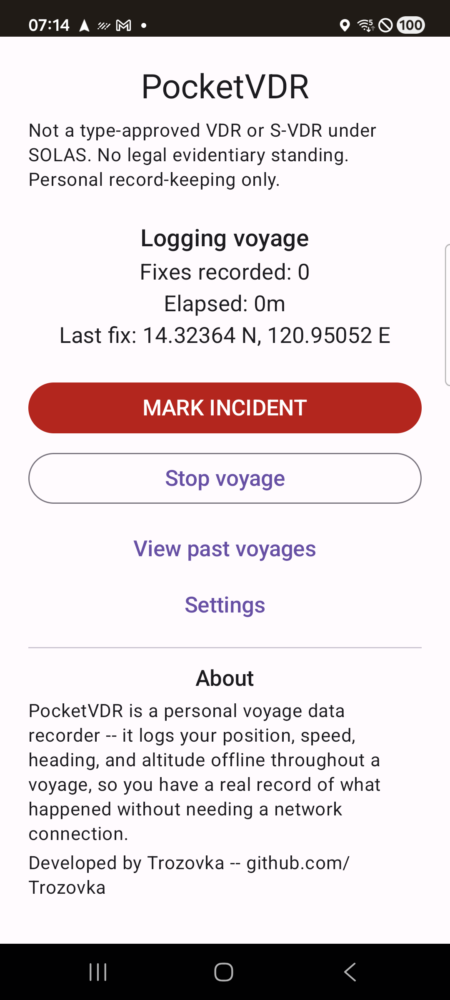
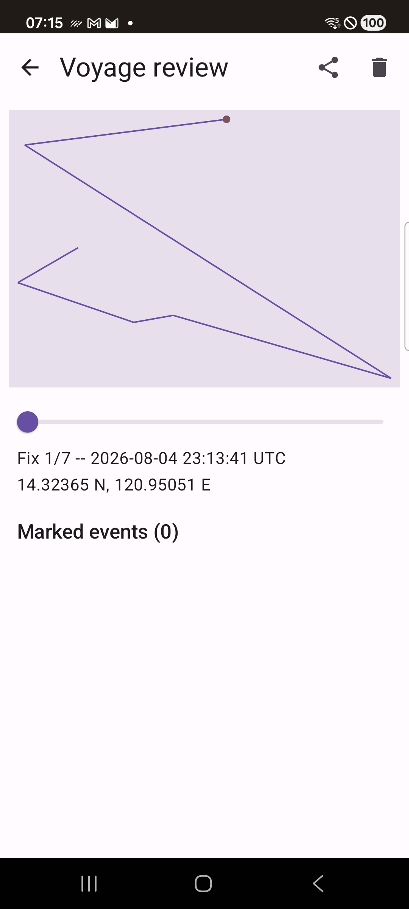

# PocketVDR Free

An unofficial, personal voyage data recorder for Android. It continuously logs position,
time, speed, heading, and altitude throughout a voyage using nothing but the phone's own GPS
chip and local storage -- purely for your own record: reviewing what happened before an
incident, proving a track for insurance, checking performance after a passage, or just having a
"what actually happened" answer instead of relying on memory.

**PocketVDR is not a type-approved VDR or S-VDR under SOLAS, has no legal evidentiary standing,
and is a personal record-keeping tool only.** This isn't a substitute for certified equipment on
vessels where that's required.

**Zero internet dependency for logging, period.** The app logs continuously using only the
phone's GPS chip and local SQLite storage -- no cloud round-trip, no server call, nothing that
can silently fail because the boat is out of signal range. Free's own manifest doesn't even
request the `INTERNET` permission.

Developed by [Trozovka](https://github.com/Trozovka).

## Screenshots

| Idle | Logging | Review |
|---|---|---|
|  |  |  |

## Features

- Logs position, UTC timestamp, speed, heading, altitude, and satellites used at a configurable
  interval (default 7s, adjustable 5-60s in Settings) via `FusedLocationProviderClient` with a
  `LocationManager` fallback, plus a live `GnssStatus` satellite count
- Real Android foreground service with a partial wake lock -- keeps logging with the screen
  locked, survives Doze once you grant the battery-optimization exemption
- Live telemetry while logging: fix count, elapsed voyage time, satellites used, and current
  position
- A big **"Mark Incident"** button that instantly tags the current position with a timestamp and
  an optional short note -- for a near-miss, weather event, or mechanical issue, findable later
  without scrubbing through hours of track
- Distinct "start voyage" / "stop voyage" sessions, with a list of past voyages you can reopen or
  permanently delete
- Review screen: the track plotted on a simple offline canvas (deliberately not map tiles -- see
  "Why no map tiles" below), a timeline scrubber, and a tap-to-jump list of marked events
- Positions are shown as `xx.xxxxx N/S, yyy.yyyyy E/W` throughout the app and in the plain-text
  export, not raw signed decimal degrees -- negative latitude is South, negative longitude is
  West, the standard convention, just spelled out instead of left as a bare sign
- Export a selected time range (or the whole voyage) as GPX, plain NMEA 0183, or a plain-text log
  readable in Notepad/WordPad -- GPX/NMEA for OpenCPN, Google Earth, or ECDIS-class chartplotters;
  the plain-text log for handing to an insurer, surveyor, or anyone without navigation software.
  The app is fully useful without ever opening any of those
- Free for 30 days from first launch with unlimited history review/export; after that, logging
  stays unlimited forever, and review/export narrows to the last 24 hours or the current voyage --
  see [Licensing](#licensing) below

## Quick install (no building required)

Download the APK from Gumroad and sideload it: **[Gumroad link once published]** ($0)

Since this isn't distributed through Google Play, Android will ask you to allow installing from
this source the first time -- that's expected.

## Build from source

Requires JDK 17 and the Android SDK (the Gradle wrapper handles the rest).

```
git clone --recurse-submodules https://github.com/Trozovka/pocketvdr-lite.git
cd pocketvdr-lite
echo "sdk.dir=/path/to/your/android-sdk" > local.properties
./gradlew assembleDebug
adb install app/build/outputs/apk/debug/app-debug.apk
```

## Why no map tiles

The review screen's track "map" is a plain Compose Canvas plot of the raw lat/lon points, not a
real basemap. A real map (e.g. osmdroid's default online tile source) needs a network call to
fetch tiles -- but this project's own design rule is that network is only ever allowed to matter
for licensing, once, opportunistically. A tile-based map would be a second place network
mattered, so the review screen stays fully offline instead, at the cost of not showing coastlines
or landmarks underneath the track.

## Licensing

Free for 30 days from first launch (tracked locally, no account needed). After that, logging
itself never stops working or gets limited -- only review/export of anything older than the last
24 hours (or outside the currently active voyage) requires
[PocketVDR Pro](#pro-version) for unlimited history.

## Tech stack

- Kotlin + Jetpack Compose, MVVM
- Gradle multi-module: `:core` (logging service, SQLite via Room, GPX/NMEA export, entitlement
  logic, all Compose UI -- shared with the Pro tier) + `:app` (thin Free launcher)
- The foreground-service/wake-lock/battery-exemption pattern and the Gumroad license-verification
  pattern are pulled in from [trozovka-android-toolkit](https://github.com/Trozovka/trozovka-android-toolkit)
  as a git submodule, shared with the sibling [OpenCPN GPS Server](https://github.com/Trozovka/opencpn-gps-server-free)
  project rather than duplicated
- minSdk 26, target latest stable Android API
- No existing open-source project was forked for this app -- searched GitHub for existing
  "personal VDR" Android apps first; the closest real match (BasicAirData/GPSLogger) is GPL-3.0,
  which would impose source-disclosure obligations on the private Pro tier, and doesn't share this
  project's flag-event/voyage-session/export model, so this was built from scratch instead

## Pro version

A Pro version with unlimited historical review/export (one-time purchase) is available
separately: **[Gumroad link once published]**. The Pro app's source is private; this Free repo
has the full free-tier source, openly available under the MIT license below.

## License

MIT -- see [LICENSE](LICENSE) for the full text.

Copyright (c) 2026 Trozovka. Original Author: Trozovka. All derivative works must retain the
[NOTICE](NOTICE) file's attribution. Not a fork of, or derived from, any other project's source.
